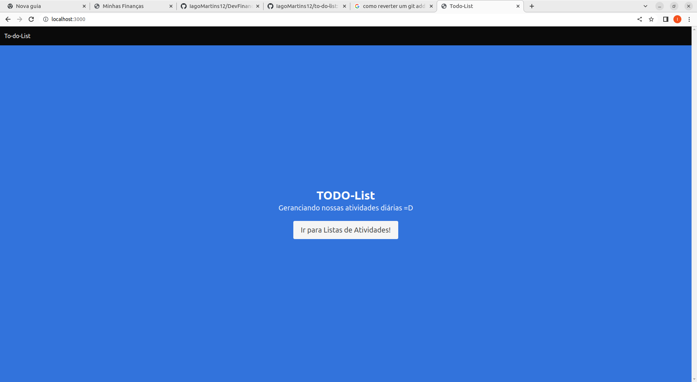
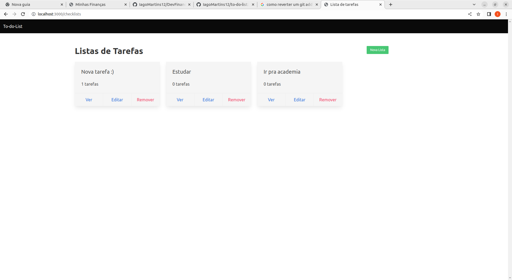
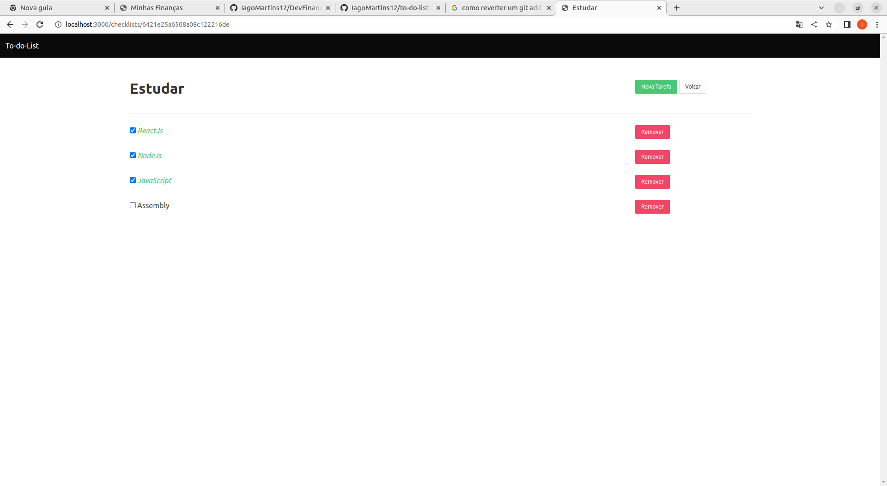
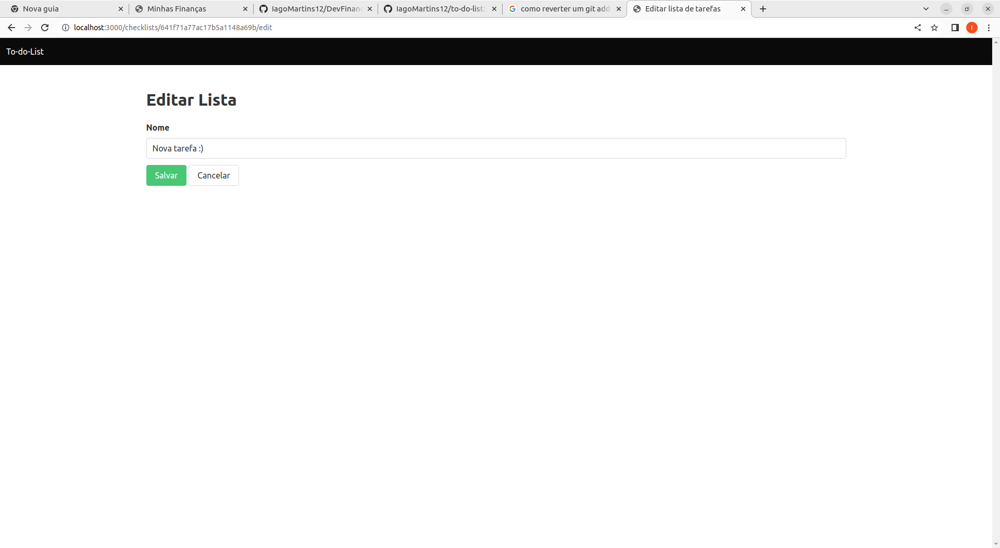

# to-do-list
Lista de tarefas feita para fins de estudo para backend, onde construi uma API com integração ao banco de dados mongo, utilizando nodeJs e ESJ para as paginas dinamicas.
Como o foco foi mais no backend, o layout do site foi pensado de maneira minimalista

# Tecnologias utilizadas no projeto: 
<ul>
    <li> NodeJs </li>
    <li> Express </li>
    <li> MongoDb </li>
    <li> ESJ (Embedded JavaScript Templates)  </li>
    <li> Mongoose </li>
    <li> Bulma </li>
</ul>


# Requisitos para rodar na sua maquina: 
<ul>
    <li> Possuir o mongoDB instalado </li>
    <li> Possuir o NodeJs instalado </li>
</ul>

# Como rodar na sua maquina? 
<p> Primeiro, é necessario subir o servidor local do mongoDB. Caso você ja possua ele instalado, abra seu terminal de comando e digite "mongo" ou "mongosh" </p>
<p> Após subir o servidor mongo, é necessario instalar as dependencias necessarias do projeto. Digite no seu terminal (dentro da pasta do projeto) o comando:  </p>
```bash
npm init -y
```
<p> Caso não tenha o npm instalado, digite:  </p>
```bash
npm install
```
<p> Após instalar as dependecias e estiver com o servidor mongo no ar, é hora de rodar o projeto. Digite no terminal o comando: </p>
```bash
npm run dev
```
<p> Pronto! o Projeto ja estará rodando na sua local :) </p>

# Imagens do projeto: 
<h3><strong>Index: </strong></h3>


<h3><strong>Checklists: </strong></h3>


<h3><strong>Tasks: </strong></h3>


<h3><strong>Formulario de edição: </strong></h3>

